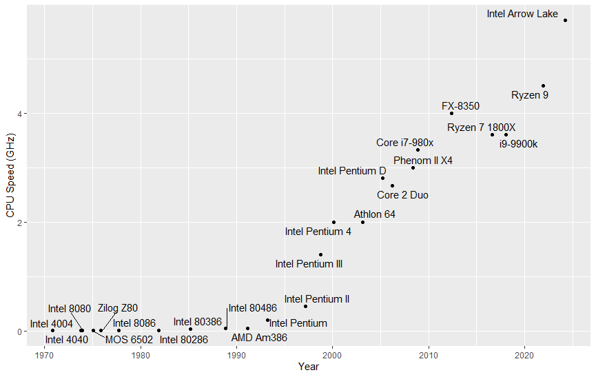
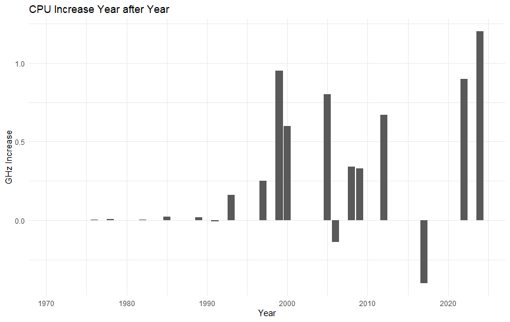
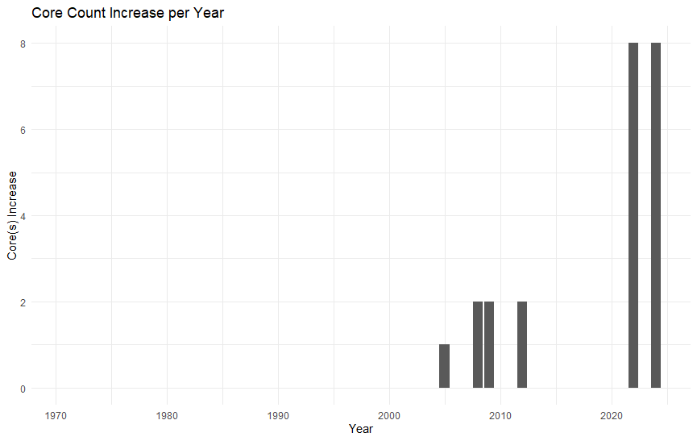

# CPU Visualization Project

## Overview
This project seeks to analyze and visualize the trends in CPU speeds and core count over the years, from early CPUs to modern day. 

## Contents

- **[Introduction](#introduction)**
- **[Data Import](#data-import)**
- **[Data Analysis](#data-analysis)**
- **[Visualizations](#visualizations)**
- **[Conclusion](#conclusion)**
- **[Requirements](#requirements)**
- **[License](#license)**

## Introduction
This project uses a dataset of CPUs from multiple years to examine the trends between their speed and core count.

## Data Import
The data is imported from a CSV file hosted on GitHub. The dataset includes the following:
- **Year**: Year of CPU release
- **Name**: Model name of the CPU
- **GHz**: Clock speed in gigahertz
- **Cores**: Number of cores in the CPU

```r
# Import CSV from GitHub
url <- "https://raw.githubusercontent.com/prunekaryote/CPU-Data-Analysis-Project/refs/heads/main/cpudata.csv"
data <- read.csv(url)
```

## Data Analysis
The data from the CSV is used to calculate the yearly average change in speed, and change in core count. 

# CPU Speed Analysis
```r
year_avgGHz <- aggregate(GHz ~ Year, data = data, FUN = mean)
year_avgGHz$increase_GHz <- c(NA, diff(year_avgGHz$GHz))
```
# CPU Core Count Analysis
```r
year_avgCore <- aggregate(Cores ~ Year, data = data, FUN = mean)
year_avgCore$increase_Cores <- c(NA, diff(year_avgCore$Cores))
```

## Visualizations
The data from the analysis is split into 3 graphs:



p1 - This graph shows each CPU and its speed by year.



p2 - This graph shows the average speed increase per year of the CPUs in the dataset.



p3 - This graph shows the average core increase per year of the CPUs in the dataset.

## Conclusion
The project demonstrates a clear upward trend in both CPU clock speeds and core counts over the years. A shift in the early 2000s shows standardization of multi-core CPUs, while speed improvements continue into the modern day.

## Requirements
**R**(version 4.0 or later)

**tidyverse**

**patchwork** and **ggrepel**

If needed, use this in R to install the necessary packages:

```r
install.packages(c("tidyverse","patchwork","ggrepel"))
```

## License
This project is licensed under the MIT License, if needed view the [LICENSE](LICENSE) file for details.
